# TradeJournal8 Architecture

This document provides a high-level overview of the TradeJournal8 platform, including its components, architecture, design decisions, data flows, and technology choices.

---

## Table of Contents

1. [Overview](#overview)
2. [Components](#components)
3. [Data Flow](#data-flow)
4. [Design Decisions](#design-decisions)
5. [Tech Stack](#tech-stack)
6. [Deployment & Docker](#deployment--docker)
7. [Future Considerations](#future-considerations)
8. [References](#references)

---

## Overview

TradeJournal8 is a modular trading journal platform focused on privacy, independent component development, and flexible deployment.  
This document captures the high-level architecture and rationale for design choices.

### Context Diagram (C1)

---

## Architecture Diagram (C2)

```mermaid
graph TD
    User[Trader You]

    subgraph TradeJournalApp
        UI[Trade Journal UI<br><i>SPA/Angular</i>]
        DB[Database<br><i>Mongo</i>]
        Uploader[Uploader Service]
        FileStorage[PDFFileStorage<br><i>Rest API + File System</i>]
        Masking[PDFMaskingProcessor]
        Parser[ParsingProcessor]
        EP[Event Platform<br><i>Kafka</i>]
    end
    Comment1[💬 secure deployment b/c confidential data, ex: unmasked financial docs]:::comment
    classDef comment fill:#fff8b0,stroke:#391,stroke-width:1px,stroke-dasharray:5 5

    %% User interaction
    User -->|Uploads PDF| Uploader
    User -->|Views Trades, Notes, Dashboards| UI
    UI --> |Trade Data<br><i>CRUD</i>| DB

    %%Backend Flow
    Uploader -->|Store unmasked pdf<br>generate masked PDF| FileStorage
    FileStorage

    %% Event flow
    
    FileStorage -->| | Masking
    Masking -->|PDFMasked event<br>masked file reference| Parser
    Parser -->|TradeParsed event<br>structured trades| DB
    Comment1 -.-> FileStorage

```

---
## Benefits
- Develops author's architectural experience
- Broadens author's working technology stack (mongo, python, kafka, etc.)
- Exposes author to using AI: coding, documenting, and within application
- Provide author a highly custom trade journal

---
## Risks
- **Privacy** Financial Records contain account# and other senstive info
    - Mitigation: 
        - Mask Financial records early to scrub sensitive info
        - Masked files will be used through out system
        - Originals for reference/audit and kept secure (local) 

---
## Assumptions

---
## Tech Stack
- **Python 3** default language for CLI, processors, etc. Concise, AI friendly, Widens author's languages
- **MongoDB** for database b/c author's recent training/learning interests
- **Docker**
- **Naming Convention** 
    - prefer short lowercase names for naming folders, especially top level
    - technology specific for naming files, class, etc.

## Option Analysis

## Decision Log
- **decision made** yyyy-dd-mm -  rational

## Outstanding
- **Item**
    -**Opened:** yyyy-mm-dd
    -**closed:** yyyy-mm-dd
    - Details
## Architecture Integration 
### Components
#### FinancialStatementsMaskerCLI
- **Purpose:** Mask sensitive information (account numbers, personally identifiable information) in PDFs.
- **Inputs/Outputs:** Input PDFs → Masked PDFs
- **Notes:** Self-contained; version independently; CLI interface.

#### FinancialStatementsProcessor
- **Purpose:** Parse financial statements and confirmations into structured JSON.
- **Inputs/Outputs:** PDFs → JSON
- **Notes:** Handles multiple formats; provides structured data for storage and analysis.

#### TradeStorageService
- **Purpose:** Store PDFs and link parsed data.
- **Inputs/Outputs:** JSON + PDFs → MongoDB or other storage
- **Notes:** Provides a single source of truth for data access.

#### UIAngular / UIReact
- **Purpose:** Dashboard for visualizing and interacting with parsed data.
- **Notes:** Angular is default; React optional for exposure and learning.

#### Docker / Containerization
- **Purpose:** Containerize components for isolation, reproducibility, and easy deployment.
- **Notes:** Each component may have its own Dockerfile; can orchestrate via docker-compose.

---

