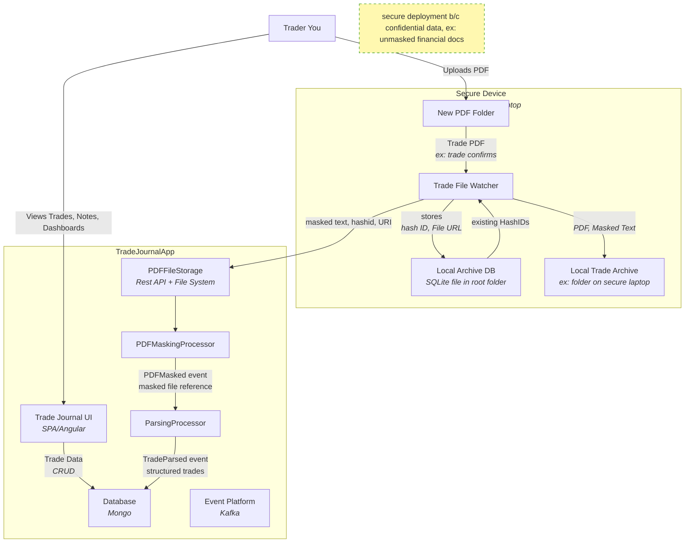

# TradeJournal8 Architecture

This document provides a high-level overview of the TradeJournal8 platform, including its components, architecture, design decisions, data flows, and technology choices.

---

## Table of Contents

1. [Overview](#overview)
2. [Components](#components)
3. [Data Flow](#data-flow)
4. [Design Decisions](#design-decisions)
5. [Tech Stack](#tech-stack)
6. [Deployment & Docker](#deployment--docker)
7. [Future Considerations](#future-considerations)
8. [References](#references)

---

## Overview

TradeJournal8 is a modular trading journal platform focused on privacy, independent component development, and flexible deployment.  
This document captures the high-level architecture and rationale for design choices.

### Context Diagram (C1)


---

## Architecture Diagram (C2)


---
## Benefits
- Develops author's architectural experience
- Broadens author's working technology stack (mongo, python, kafka, etc.)
- Exposes author to using AI: coding, documenting, and within application
- Provide author a highly custom trade journal


---
## Risks
- **Privacy** Financial Records contain account# and other senstive info
    - Mitigation: 
        - Mask Financial records early to scrub sensitive info
        - Masked files will be used through out system
        - Originals for reference/audit and kept extra secure, ex: personal device 

---
## Assumptions

---
## Tech Stack
- **Python 3** default language for CLI, processors, etc. Concise, AI friendly, Widens author's languages
- **MongoDB** for database b/c author's recent training/learning interests
- **Docker**
- **Naming Convention** 
    - prefer short lowercase names for naming folders, especially top level
    - technology specific for naming files, class, etc.

## Option Analysis

## Decision Log
``` text
*Template*
- yyyy-mm-dd **decision made**
    - **Rational:** 
    - **Consequences:**
```
- 2025-10-18 - **Mask to txt file instead of PDF**
    - **Rational**: 
        - Generating a Masked PDF file much more complex than expected
        - Not good learning ROI
    - **Consequences:**
        - Generate a masked txt file instead.
        - hyperlink to original PDF if user on laptop
        
- 2025-09-21 – **Masking moved earlier in ingestion**
  - **Rationale:** Enforce privacy of originals by ensuring masking and updating occur early within a separate trust boundary (e.g., personal computer).  
  - **Consequences:**  
    - Originals remain secured locally.  
    - Rest of system can safely move to the cloud without risk of leaking personal data.  


## Outstanding
```
*Template*
- **Item**
    -**Opened:** yyyy-mm-dd
    -**closed:** yyyy-mm-dd
    - Details
```

## Architecture Integration 
### WebBroker (System / 3rd party)
- My trade brokerage system
- Manual interaction, secure integration not supported


### Secure Device (System)
- Personal computer
- Secure Trusted Boundary 
- Hosts original financial statements, generates masked versions and uploads to TradeJournal8 via TradeStorageService

#### TradeFileWatcher
- **Purpose:** Monitors a folder for new trade files (e.g., confirmations) and executes a pre-processing pipeline including masking sensitive information, archiving files locally, computing file hashes for duplicate detection, storing metadata, and finally uploading the masked text to the TradeFileStorage API.
- **Inputs/Outputs:** 
    - Input: PDF trade confirmations detected via filewatcher.
    - Outputs:
        - Original PDF and corresponding Masked Text File stored in the local Trade File Archive.
        - Metadata (hash, file URIs, timestamps) stored in a lightweight local DB for duplicate checking
        - Masked Text File posted to TradeFileStorage API.

### TradeJournal8 (System)


#### FinancialStatementsProcessor
- **Purpose:** Parse financial statements and confirmations into structured JSON.
- **Inputs/Outputs:** Masked Text File → JSON
- **Notes:** Handles multiple formats; provides structured data for storage and analysis.

#### TradeStorageService
- **Purpose:** Store Masked Text File and link parsed data.
- **Inputs/Outputs:** JSON + Masked Text File → MongoDB or other storage
- **Notes:** Provides a single source of truth for data access.

#### UIAngular / UIReact
- **Purpose:** Dashboard for visualizing and interacting with parsed data.
- **Notes:** Angular is default; React optional for exposure and learning.

#### Docker / Containerization
- **Purpose:** Containerize components for isolation, reproducibility, and easy deployment.
- **Notes:** Each component may have its own Dockerfile; can orchestrate via docker-compose.

---

